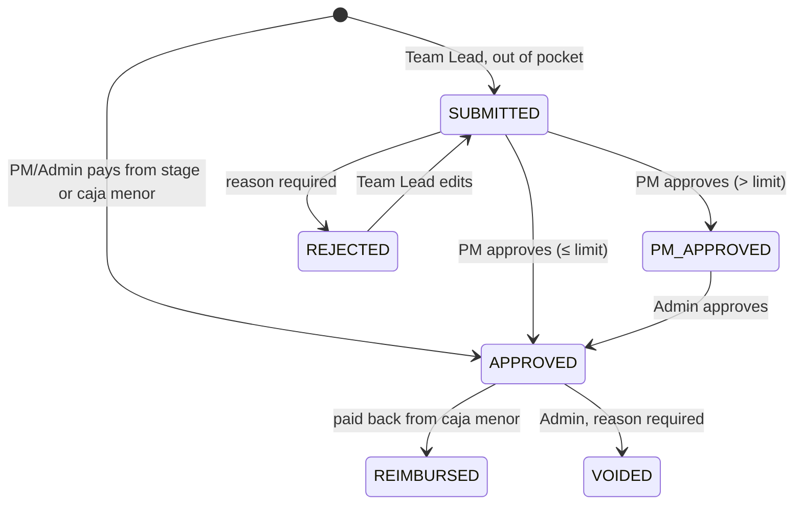

# Control de Proyectos — Product Requirements Document

> As of 2026-09-28. Describes the product as built (phases 0–5) and the rules the code enforces.
> Detailed per-phase rules live in [SPEC.md](SPEC.md); deployment steps in [DEPLOYMENT.md](DEPLOYMENT.md).
> UI language: Spanish (es-CO). Code, database, API and docs: English.

## 1. Overview

Control de Proyectos lets a building owner see, at any moment, where every peso went and how each
construction project is doing against a locked budget. It tracks several projects, each split into
ordered stages with a budget, owner deposits, expenses, weighted milestones and a timeline.

**Problem.** Owners fund projects in tranches and lose sight of how the money is used. Managers pay
from stage funds, a petty cash box (caja menor) and team leads' own pockets, and overruns get hidden.

**Users.** One owner (Admin), project managers who run the work, and team leads who spend on site.

**Goals**

- Lock the budget once approved; flag every overrun instead of hiding it.
- Account for every peso through a ledger of signed entries. Nothing money-related is hard-deleted.
- Measure progress with weighted milestones and earned value (CPI, SPI, EAC).
- Run on cPanel shared hosting: no Docker, no Node runtime, no long-running workers in production.

**Non-goals (v1):** Excel/PDF export, budget templates, Gantt editing, payroll detail beyond amounts,
currency conversion inside a project.

## 2. Users and roles

Admin is global. Project Manager (PM) and Team Lead are assigned per project (`ProjectMember`).

| Role | Scope | Responsibilities |
| --- | --- | --- |
| Admin (owner) | Global | Creates projects and memberships, approves budgets, deposits money, draws contingency, completes stages, gives final approval to over-limit expenses, signs off caja menor cycles, voids movements and expenses, manages users and settings, reads the audit log. Sees everything. |
| Super admin | Flag on an Admin | Everything an Admin does, plus granting/revoking super admin and using "Ver como". The first admin created with `app:create-admin` is a super admin. |
| Project Manager | Assigned projects | Drafts the plan and budget, starts stages, completes milestones, records expenses from stage funds or caja menor, approves Team Lead expenses, reimburses them, closes caja menor cycles. |
| Team Lead | Assigned projects | Records out-of-pocket expenses with receipts, sees own expenses and what they are owed. Sees stages and milestones but no money figures. |

### Permission matrix

| Action | Admin | PM | Team Lead |
| --- | :-: | :-: | :-: |
| Create project, assign/remove members, change project status | ✅ | — | — |
| Edit stages, categories, budget lines, milestones, contingency (while draft) | ✅ | ✅ | — |
| Submit budget | ✅ | ✅ | — |
| Approve or return budget | ✅ | — | — |
| Start stage, complete milestone | ✅ | ✅ | — |
| Reopen completed milestone | ✅ | — | — |
| Register deposit, draw contingency, void movement | ✅ | — | — |
| Record expense from stage funds or caja menor | ✅ | ✅ | — |
| Record out-of-pocket expense | — | — | ✅ |
| Approve/reject Team Lead expense (up to limit) | ✅ | ✅ | — |
| Final approval above the limit | ✅ | first step only | — |
| Reimburse Team Leads, close caja menor cycle | ✅ | ✅ | — |
| Sign off cycle, void expense, complete stage | ✅ | — | — |
| View financials and dashboards | ✅ | ✅ | — |
| Users, settings, audit log | ✅ | — | — |
| View own expenses and amount owed | ✅ | ✅ | ✅ |

**Authorization model.** `ProjectVoter` answers `PROJECT_VIEW` (any member), `PROJECT_PLAN` and
`PROJECT_VIEW_FINANCIALS` (PM), `PROJECT_ADMINISTER` (Admin only). Admins pass every check.
Symfony roles: `ROLE_USER`, `ROLE_ADMIN`, `ROLE_SUPER_ADMIN`.

**Accounts.**

- Session-cookie login by email and password; 5 failed attempts per 15 minutes are throttled.
- Disabled users cannot log in. Emails are unique and stored lowercase.
- Users change their own password. An Admin cannot remove their own admin access or disable themselves.
- Only a super admin can grant or revoke super admin.

**Impersonation ("Ver como").** Permanent feature, used for manual testing.

- Enabled by `IMPERSONATION_ENABLED` (off by default in production).
- Only super admins, only on active, non-admin users other than themselves.
- Switching needs a POST with the CSRF header; a GET link is refused (`switch_user_not_allowed`).
- `/api/me` returns the impersonator so the UI shows who is really acting and offers "exit".

## 3. Domain model

| Entity | Key fields | Notes |
| --- | --- | --- |
| User | email, fullName, password, admin, superAdmin, active | Global. |
| Project | name, description, currency, status, plannedStart, plannedEnd | Status `DRAFT → ACTIVE → COMPLETED → ARCHIVED`. Currency fixed at creation (default from settings). |
| ProjectMember | project, user, role | Role `PROJECT_MANAGER` or `TEAM_LEAD`. |
| Stage | name, position, status, planned/actual start and end | Ordered. Status `PENDING → IN_PROGRESS → COMPLETED`. |
| Category | project, name | Per project (e.g. Payroll, Materials). Budget-vs-actual breakdown and deposit earmarks. |
| Budget | project (1:1), status, contingency, approvedAt | Status `DRAFT → SUBMITTED → APPROVED`, or `SUBMITTED → RETURNED` (editable again). |
| BudgetEvent | budget, status, user, comment | Every budget transition, with the Admin's comment on return. |
| BudgetLine | stage, category, description, unit, quantity, unitPrice, total | Total = quantity (≤ 3 decimals) × unit price, rounded half-up to the minor unit. |
| Milestone | stage, name, weight, plannedDate, completedAt, completedBy, completionNotes | Weights stored in basis points; sum to 100% per stage. |
| FundMovement | type, date, amount, method, reference, note, voided*, pettyCashCycle | Types `DEPOSIT`, `CONTINGENCY_DRAW`, `CARRYOVER`, `EXPENSE`, `REIMBURSEMENT`. |
| LedgerEntry | movement, account, stage, category, signed amount | Account `STAGE` (by stage), `PETTY_CASH`, `CONTINGENCY`. |
| Expense | stage, category, date, amount, description, supplier, invoiceNumber, paidFrom, paidBy, status, rejectionReason, movement, reimbursement | `paidFrom`: `STAGE`, `PETTY_CASH`, `OUT_OF_POCKET`. |
| ExpenseEvent | expense, type, user, comment, previous values | Full history of edits and transitions. |
| Reimbursement | project, movement, method, reference, expenses | Pays back one or more Team Lead expenses. |
| PettyCashCycle | number, status, openingBalance, closingBalance, closedBy, signedOffBy | Status `OPEN → CLOSED → SIGNED_OFF`. |
| Attachment | project, movement or expense, storedName, originalName, mimeType, size, uploadedBy | Deposit proofs and expense receipts. |
| AuditLog | projectId, user, action, entityType, entityId, changes | Before/after values, passwords masked. |
| Setting | key, value | Global key-value settings. |

**Money.** Stored as `BIGINT` minor units, handled with `brick/money`. Never floats.
**Balances.** Always computed from non-voided ledger entries; never stored.

## 4. Functional requirements

### 4.1 Projects and team
- Admin creates projects, edits them, changes status, and adds or removes PMs and Team Leads.
- Admins and PMs see the project list; members see only their projects.

### 4.2 Planning and budget
- PM (or Admin) builds the plan: categories, ordered stages with planned dates, budget lines per stage,
  milestones per stage, and one contingency amount.
- **Submit / approve gate:** every stage has at least one budget line and its milestone weights add up
  to exactly 100%.
- Editing is allowed only while the budget is `DRAFT` or `RETURNED`. While `SUBMITTED` or `APPROVED`
  nobody edits it, the Admin included.
- Admin approves (project becomes `ACTIVE`) or returns with a comment.
- After approval: stage names can still be corrected and categories added. Planned dates, lines,
  milestone weights and contingency are locked. A category is deleted only if nothing uses it.

### 4.3 Progress
- Stages start (PM/Admin, after approval) with an actual start date.
- Milestones are completed after approval, with a completion date not in the future and optional notes.
  Only the Admin reopens one.
- Stage progress = Σ weights of completed milestones.
- Stage weight = stage budget / total budget (contingency excluded).
- Project progress = Σ(stage progress × stage weight).

### 4.4 Funding (deposits, contingency, carry-over)
- Admin records deposits only after budget approval; date not in the future; method `TRANSFER`,
  `CASH`, `CHECK` or `OTHER`; reference, note and proof files.
- A deposit is split into allocations to a stage (optional category earmark), the caja menor or the
  contingency. The deposit amount is the sum of its allocations. Completed stages cannot receive money.
- Availability is tracked per stage; categories are earmarks for reporting, not separate balances.
- **Contingency draw:** Admin only, capped at the contingency's available balance, into an unfinished
  stage, reason required. Draws stay visible as such.
- **Completing a stage:** Admin only; stage must be in progress with all milestones met. Its remaining
  balance moves automatically (`CARRYOVER`) to the next unfinished stage, or to the contingency if none.
  A stage never carries a deficit; extra money comes from new deposits.
- **Voiding:** Admin only, with a reason; the movement stays in history. Refused if it would leave any
  account below zero, if it is a carry-over, or if it belongs to a closed caja menor cycle.
- Per stage the app shows budget, received, spent, available, funded beyond budget, % funded,
  remaining budget and % executed.

### 4.5 Expenses

- PM and Admin pay from **stage funds** or the **caja menor**; those expenses count immediately.
  Team Leads record **out-of-pocket** expenses only.
- **No overdrafts:** paying requires enough money in the account, else `insufficient_funds` with the
  available amount. Reimbursements follow the same rule against the caja menor.
- Approving a Team Lead expense requires at least one receipt. Rejecting requires a reason.
- Every edit stores the previous values in the expense history.
- An expense counts against the budget (stage and category) once `APPROVED`, and stays counted when
  `REIMBURSED`. Cash leaves the account when paid, or when the Team Lead is reimbursed.
- Void: Admin only, approved and not yet reimbursed; the money returns to its account.
- A completed stage cannot be charged to its stage funds, but late caja menor or Team Lead expenses
  may still be assigned to it.
- Team Leads see and download only their own expenses and receipts, with a summary of pending and owed.
  Managers see all, plus counts of pending approvals and reimbursements.

### 4.6 Caja menor (petty cash)
- One per project, held by the PM, funded from `PETTY_CASH` allocations.
- Every caja menor movement belongs to the open cycle; the first cycle is created on first use.
- PM or Admin closes the cycle: a snapshot of opening balance, top-ups, expenses with receipts and
  closing balance. The next cycle opens with that balance.
- Admin signs off closed cycles. Unsigned cycles are flagged but do not block new top-ups.
- **Reimbursement:** one operation pays one or more approved Team Lead expenses (date, method, reference).

### 4.7 Attachments
- PDF, JPG, PNG, WEBP or HEIC, up to 10 MB; type detected from content, not the browser's claim.
- Stored outside the web root in `var/uploads/<project>/` under random names, served by a controller
  that checks permissions. Deposit proofs: Admin and PM only. Receipts: managers, and the Team Lead who owns the expense.

### 4.8 Dashboards
- **Portfolio (`/dashboard`)**, home for Admins and PMs: per project budget, spent, real vs planned
  progress, CPI, SPI and alert count.
- **Project dashboard tab:** spent vs budget, progress vs plan, CPI/SPI with health label, forecast at
  completion, current alerts, progress vs spend per stage, deposits vs spending per month, stage timeline.
  Every chart has a table view.
- **Finance tab:** per-stage funding, budget vs actual per category, contingency, deposit ledger with splits and proofs.
- **Team Lead view:** my expenses, their status, and what I am owed.

**Earned value**

| Measure | Definition |
| --- | --- |
| BAC | Σ stage budgets (contingency excluded) |
| AC | Approved spending |
| EV | BAC × weighted-milestone progress |
| PV | Share of each stage due today: by milestone planned dates when all have one, else linear between the stage's planned start and end |
| CPI / SPI / EAC | EV/AC · EV/PV · BAC/CPI |
| Health | ≥ 1 good · 0.9–1 warning · < 0.9 critical |

### 4.9 Email alerts
Spanish HTML emails, buffered during the request and sent only if it succeeds, via the Messenger queue.

| Trigger | Recipients |
| --- | --- |
| Budget submitted | Admins |
| Budget returned or approved | PM |
| Team Lead expense submitted or resubmitted | PM |
| Over-limit expense approved by the PM | Admins |
| Expense rejected; expenses reimbursed | The Team Lead |
| Caja menor cycle closed | Admins |
| Stage or category spending crosses a warning threshold (highest only) | Admins + PM |
| Caja menor below the low-balance % of the last top-up | Admins + PM |
| Daily digest `app:alerts:daily`: overdue milestones, pending approvals and reimbursements, unsigned cycles | Admins + PM of each active project |

### 4.10 Settings (Admin)

| Setting | Default |
| --- | --- |
| Default currency (new projects) | COP |
| Team Lead per-expense limit | 500.000 COP |
| Caja menor low-balance threshold | 20% of the last top-up |
| Budget warning thresholds | 80%, 100% |

### 4.11 Audit log
A Doctrine listener records create, update and delete on planning, money, user and settings entities:
who, when, before/after values (passwords masked). Admins browse it at `/audit`, filtered by project
and record type.

### 4.12 Help center
In-app help (`/help`, `/help/:topicId`) in Spanish with screenshots and search: one topic per task,
from logging in to budget approval, deposits, expenses, caja menor, users, settings, audit and "Ver como".

## 5. Key workflows

1. **Set up.** Admin creates the project and assigns a PM and Team Leads.
2. **Plan.** PM adds categories, stages, budget lines, milestones and contingency, then submits.
3. **Approve.** Admin approves (project `ACTIVE`, budget locked) or returns with a comment → back to step 2.
4. **Fund.** Admin records deposits and splits them across stages, caja menor and contingency.
5. **Execute.** PM starts stages and records expenses; Team Leads submit out-of-pocket expenses; PM
   (and Admin above the limit) approves; PM reimburses from caja menor.
6. **Petty cash.** PM closes the cycle when low or to request a top-up; Admin signs it off and tops up.
7. **Progress.** PM completes milestones; Admin completes the stage and the leftover carries over.
8. **Monitor.** Dashboards, threshold emails and the daily digest surface overruns and pending work.

## 6. API surface

All JSON under `/api`. State-changing calls require the `X-Requested-With: XMLHttpRequest` header
(CSRF defense); errors use problem codes such as `insufficient_funds` or `budget_not_approved`.
Any non-`/api` GET is served the React SPA.

| Area | Endpoints |
| --- | --- |
| Auth | `POST /login`, `POST /logout`, `GET /me`, `POST /me/password`, `POST /impersonate?_switch_user=<email\|_exit>` |
| Users (Admin) | `GET /users`, `POST /users`, `PATCH /users/{id}` |
| Settings (Admin) | `GET /settings`, `PUT /settings` |
| Projects | `GET/POST /projects`, `GET/PATCH /projects/{id}`, `POST /projects/{id}/members`, `DELETE /projects/{id}/members/{memberId}` |
| Plan | `GET /projects/{id}/plan`, `POST /projects/{id}/categories`, `POST /projects/{id}/stages`, `PUT /projects/{id}/stages/order`, `PUT /projects/{id}/budget/contingency`, `POST /projects/{id}/budget/{submit\|return\|approve}` |
| Stages | `PATCH/DELETE /stages/{id}`, `POST /stages/{id}/start`, `POST /stages/{id}/complete`, `POST /stages/{id}/lines`, `POST /stages/{id}/milestones` |
| Lines, categories, milestones | `PUT/DELETE /budget-lines/{id}`, `PATCH/DELETE /categories/{id}`, `PATCH/DELETE /milestones/{id}`, `POST /milestones/{id}/{complete\|reopen}` |
| Finance | `GET /projects/{id}/finance`, `GET /projects/{id}/movements`, `POST /projects/{id}/deposits`, `POST /projects/{id}/contingency/draws`, `POST /movements/{id}/void`, `POST /movements/{id}/attachments`, `GET /attachments/{id}` |
| Expenses | `GET/POST /projects/{id}/expenses`, `GET/PUT /expenses/{id}`, `POST /expenses/{id}/{approve\|reject\|void}`, `POST /expenses/{id}/attachments`, `POST /projects/{id}/reimbursements` |
| Caja menor | `GET /projects/{id}/petty-cash`, `POST /projects/{id}/petty-cash/close`, `GET /petty-cash-cycles/{id}`, `POST /petty-cash-cycles/{id}/sign-off` |
| Monitoring | `GET /dashboard`, `GET /projects/{id}/dashboard`, `GET /audit` |

**Frontend routes:** `/login`, `/dashboard`, `/projects`, `/projects/:id` (tabs: plan, finance,
expenses, caja menor, dashboard), `/help`, `/help/:topicId`, and Admin-only `/users`, `/settings`, `/audit`.

## 7. Non-functional requirements

- **Stack:** Symfony 8.1 on PHP ≥ 8.4.1, Doctrine ORM + Migrations, Security, Validator, Serializer,
  Mailer, Messenger (Doctrine transport). MySQL or MariaDB without engine-specific features.
  React + TypeScript + Vite, MUI, React Router, TanStack Query, react-i18next, Recharts; built into
  `backend/public/app` and served by Symfony (same origin, no CORS, no Node on the server).
- **Security:** session cookies, CSRF header on every write, login throttling, disabled-user check,
  per-project voter, files outside the web root, content-sniffed uploads.
- **Integrity:** money in minor units; balances derived from the ledger; no hard deletes of money records;
  voids with reasons; full audit trail.
- **Localization:** Spanish UI, `Intl` formatting with the es-CO locale.
- **Quality:** PHPUnit (unit + API tests on a MySQL test DB) and `tsc` + Vitest/Testing Library.
  A change is done only when `make test` passes in Docker.

## 8. Deployment and operations

- **Local:** Docker Compose with `php` (Apache + mod_php, like cPanel), `mysql` 8.0, `node` 22 (Vite)
  and `mailpit`. `make up | install | migrate | admin | seed | test | build`. `make seed` loads three demo
  projects and demo accounts (password `demo1234`).
- **Production (cPanel):** `deploy/cpanel-update.sh [ref]` pulls a branch, tag or commit from GitHub,
  builds the frontend and a production `vendor/` on PHP 8.4, writes a `MANIFEST`, copies the release,
  then `deploy/update.sh` backs up, removes dropped files, warms the cache, migrates and runs `app:doctor`.
  `.env.local` and `var/` are never touched.
- **Cron:** every minute `messenger:consume async --time-limit=50`; daily 07:00 `app:alerts:daily`;
  daily 02:30 `backup.sh` (database + `var/uploads`, 14 days kept).
- **Commands:** `app:create-admin` (first admin = super admin), `app:alerts:daily`, `app:doctor`
  (checks PHP version, extensions, env, writable folders, frontend build, DB connection and migrations).
- Rollback = deploy the previous tag; migrations are not reverted, so restore the pre-deploy backup if needed.

## 9. Open questions and gaps

- **Per-project setting overrides** (Team Lead limit, low-balance %, warning thresholds) are in the
  spec but only global settings exist.
- **Milestone evidence files** are in the spec; attachments link only to movements and expenses.
- **Project status** `COMPLETED`/`ARCHIVED` is set by hand by the Admin; no rule ties it to stage completion.
- **Future scope:** Excel/PDF export, budget templates, Gantt chart.
