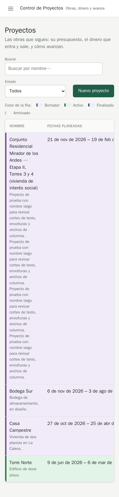
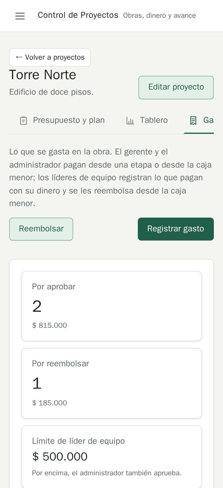
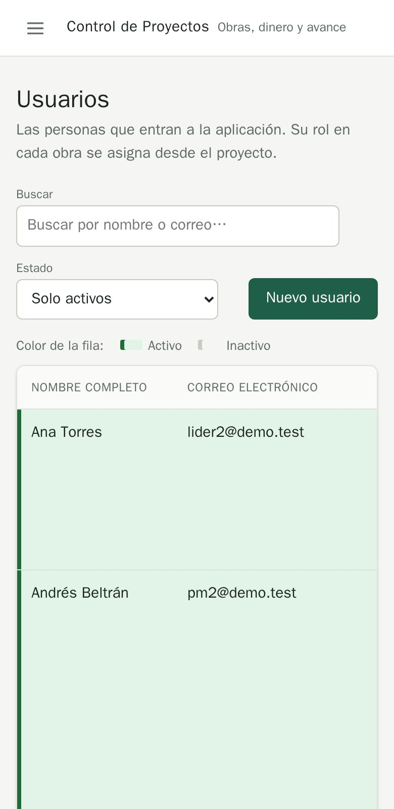

# QA-0001 · On a phone, tables scroll sideways inside their card and the Acciones column is off-screen

## Summary

At 390px every table keeps its desktop columns and scrolls horizontally inside `.table-wrap`, so the row actions (approve, reject, view, Quitar, Firmar…) and most data columns are hidden, with no hint that the table scrolls.

## Steps to reproduce

Account: admin@demo.test (super admin) · Data: `make seed` + the edge-case data of run 2026-10-07-admin-ui · Width: 1440 and 390 · Theme: light

1. Open /projects/1?tab=expenses at 390px.
2. Look at the expenses table.
3. Repeat on /projects, /users, /audit, Fondos › Movimientos, Caja menor › Ciclos anteriores, Resumen › Equipo.

## Expected

Every row's main action is reachable without discovering a hidden horizontal scroll. Skill rule 3.2: "tables become something usable" at 390px; MDX ux.md: amounts and identifiers on one line.

## Actual

Only the first two columns show (Fecha + Gasto on Gastos; Nombre + Fechas on Proyectos; Nombre + Correo on Usuarios). Approve/reject/void on Gastos, the view button on Proyectos, the role select and Quitar on Resumen are all past the right edge. The first column is squeezed to ~120px, so the 4-line description of a project becomes a 40-line row (Proyectos) and Usuarios rows grow to 150px+ because the hidden Proyectos column wraps tall.

## Evidence

`.table-wrap { overflow-x: auto }` (backend/assets/styles/app.css:1127); no phone layout for `DataTable`/`ListView`. Page-level `scrollWidth - innerWidth` is 0, so it is not caught by an overflow check: the scroll is inside the card.

## Suspected cause

`DataTable` (backend/assets/react/shared/ui/ui.tsx:769) renders a plain `<table>` at all widths; the only table rule under `@media (max-width: 600px)` lets a figure's note wrap (app.css:2102).

## History

- 2026-10-07 · found in run 2026-10-07-admin-ui at 4391ad0
- 2026-10-08 · fixed in `e074e66` on `feature/ui-audit-fixes`; re-checked on its stack at 1440 and 390 px: phone tables are cards (smoke UI-05; card cells no longer clipped after 34629e0)
