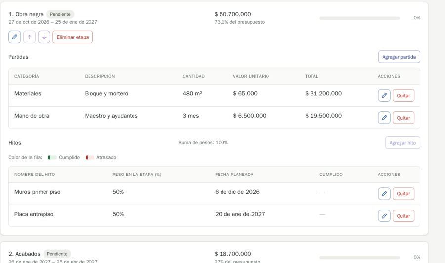
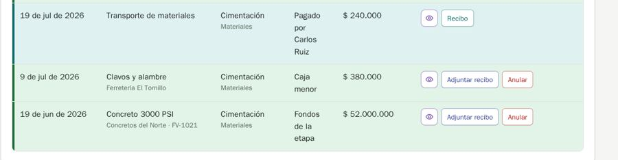

# QA-0002 · Two button systems: page actions use a generic dark-green Button, everything else uses the action colours

## Summary

The page-level actions are the generic `Button` (filled dark green, or the pale-green `secondary`), while every in-content action is an `ActionButton` coloured by its kind of action, so the same verb looks different depending on where it sits.

## Steps to reproduce

Account: admin@demo.test (super admin) · Data: `make seed` + the edge-case data of run 2026-10-07-admin-ui · Width: 1440 and 390 · Theme: light

1. /projects/2?tab=plan: compare "Agregar etapa" (filled dark green) with "Agregar partida", "Agregar hito" and the category "Agregar" (indigo outline).
2. /projects/1?tab=expenses: "Registrar gasto" (dark green) and "Reembolsar" (pale-green secondary).
3. Any project: "Editar proyecto" is pale green, while every other edit in the app is blue.

## Expected

MDX CLAUDE.md §2: "There is no generic dark-green or grey action button: `Button` is only `ghost` or `link`." One filled action per group, in the colour of its kind (setup = indigo for adding/registering, edit = blue, confirm = green).

## Actual

Generic `Button` (default `variant='primary'`) for: Nuevo proyecto, Nuevo usuario, Registrar gasto, Registrar depósito, Agregar etapa, Guardar (Configuración), Ir al inicio (404). `variant='secondary'` for: Editar proyecto, Reembolsar, Usar contingencia, Cerrar ciclo. The same "Agregar" verb appears in two colours on one screen.

## Evidence

Generic usages: widgets/project-list/ui/ProjectList.tsx:33, widgets/user-list/ui/UserList.tsx:28, widgets/expense-board/ui/ExpenseBoard.tsx:112-119, widgets/finance-board/ui/FinanceBoard.tsx:71-78, widgets/petty-cash-board/ui/PettyCashBoard.tsx:65, widgets/plan-board/ui/PlanBoard.tsx:29, pages/project-detail/ui/ProjectDetailPage.tsx:87, features/settings-edit/ui/SettingsForm.tsx:98, pages/not-found/ui/NotFoundPage.tsx:11 (`btn btn-primary`).

## History

- 2026-10-07 · found in run 2026-10-07-admin-ui at 4391ad0
- 2026-10-08 · fixed in `e0e1a6f` on `feature/ui-audit-fixes`; re-checked on its stack at 1440 and 390 px
