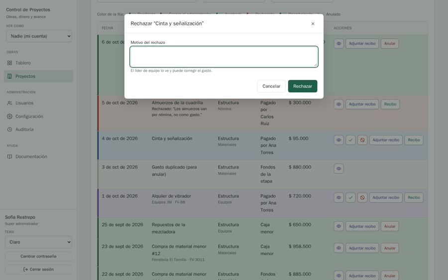
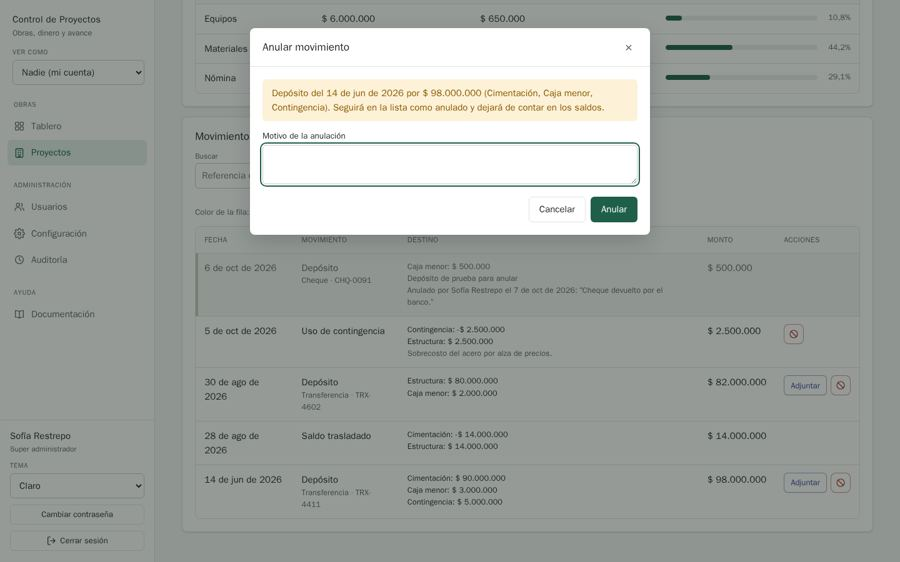
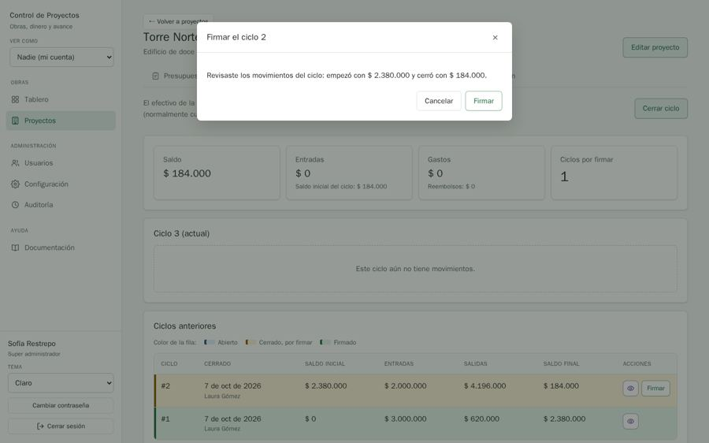

# QA-0003 · Modal footers disagree: destructive submits are filled green, confirmations are outlined

## Summary

A form modal's submit is always the generic filled green button whatever it does, so "Rechazar" and "Anular" (void a movement) are green. A confirm modal's button is outlined, so "Firmar" and "Enviar a aprobación" have no filled main action at all.

## Steps to reproduce

Account: admin@demo.test (super admin) · Data: `make seed` + the edge-case data of run 2026-10-07-admin-ui · Width: 1440 and 390 · Theme: light

1. Gastos › "Cinta y señalización" › reject (ban icon) → footer "Rechazar" is filled green.
2. Fondos › Movimientos › ban icon on a deposit → "Anular" is filled green.
3. Caja menor › "Firmar" → "Firmar" is outlined green.
4. Casa Campestre › "Enviar a aprobación" → outlined green; "Eliminar etapa" → outlined red.

## Expected

MDX §2: a modal's footer has one main action, filled, in its kind's colour; reject/void/remove are `danger` (red); Cancelar is ghost. The same kind of action looks the same in the row that opens the modal and in the modal's footer (the ConfirmModal doc comment says exactly this).

## Actual

Three footer styles: filled generic green (every FormModal), outlined in the action colour (every ConfirmModal), and red outline (danger confirms). Rejecting an expense and voiding money are styled like saving.

## Evidence

FormModal renders `<Button type="submit">` with no action (shared/ui/ui.tsx:967); ConfirmModal renders `<ActionButton action={action} size="md">` without `main` (shared/ui/ConfirmModal.tsx:36).

## History

- 2026-10-07 · found in run 2026-10-07-admin-ui at 4391ad0
