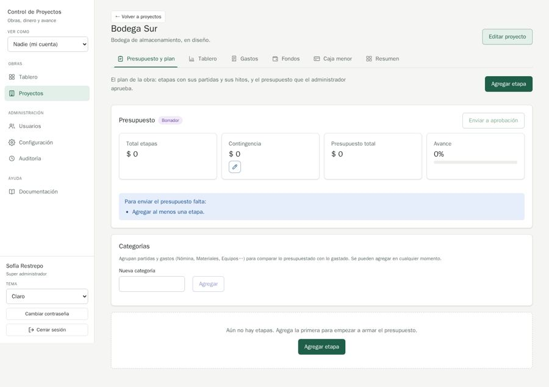

# QA-0005 · A tab's main action sits beside the tab intro, not at the end of the filter bar like Proyectos and Usuarios

## Summary

"Registrar gasto", "Reembolsar", "Registrar depósito", "Usar contingencia", "Cerrar ciclo" and "Agregar etapa" are placed to the right of the tab's intro sentence, while on Proyectos and Usuarios "Nuevo …" ends the filter bar. On an empty Plan, "Agregar etapa" shows twice.

## Steps to reproduce

Account: admin@demo.test (super admin) · Data: `make seed` + the edge-case data of run 2026-10-07-admin-ui · Width: 1440 and 390 · Theme: light

1. /projects ("Nuevo proyecto" at the end of the filter bar).
2. /projects/1?tab=expenses ("Registrar gasto" next to the intro, a card above the filter bar).
3. /projects/3?tab=plan ("Agregar etapa" in the header and again in the empty state).

## Expected

MDX ux.md › The page: "The primary action sits at the end of the table's FilterBar … on a tabbed page and on a page without tabs. People learn one place to look for add." Empty states "do not repeat the title row's main button".

## Actual

Two places for "add" depending on whether the list is a page or a tab; duplicate "Agregar etapa" on Bodega Sur.

## Evidence

## History

- 2026-10-07 · found in run 2026-10-07-admin-ui at 4391ad0
- 2026-10-08 · fixed in `f9f9aee` on `feature/ui-audit-fixes`; re-checked on its stack at 1440 and 390 px
