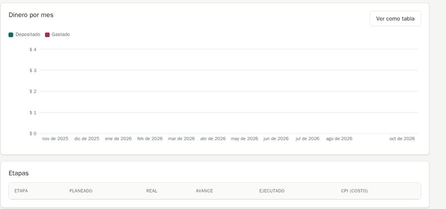
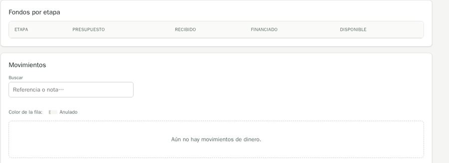
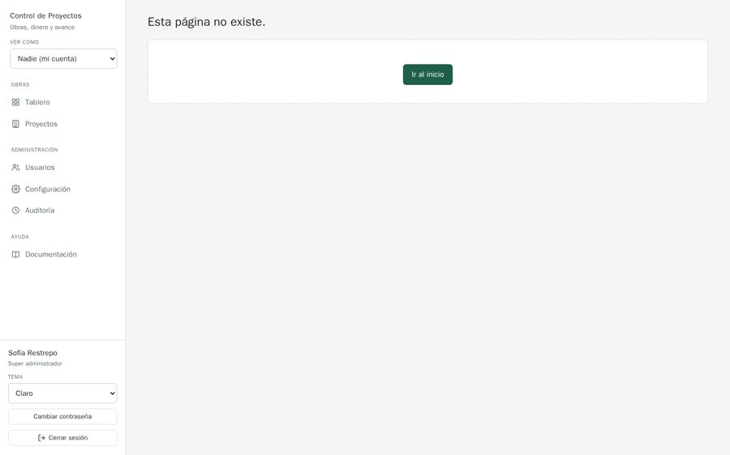

# QA-0006 · Empty lists look four different ways; empty charts draw a blank axis

## Summary

An empty table is either a header with no body (Tablero › Etapas, Fondos › Fondos por etapa), a dashed box outside the table (Gastos, Movimientos, Caja menor), or plain text ("Nada por ahora."); "Dinero por mes" draws a $0–$4 axis over 12 empty months; the 404 is a dashed box holding only a button.

## Steps to reproduce

Account: admin@demo.test (super admin) · Data: `make seed` + the edge-case data of run 2026-10-07-admin-ui · Width: 1440 and 390 · Theme: light

1. Open Bodega Sur (/projects/3) › Tablero, Fondos, Gastos, Caja menor.
2. Open /nope.

## Expected

MDX ux.md › Empty states: with a table header, the empty state shows inside the table, under the header, and says what the section is for and points somewhere. A chart with no data shows an empty state, not an axis.

## Actual

Header-only tables with nothing under them; dashed boxes elsewhere; a chart with a $4 scale; no message on the 404 box.

## Evidence

## History

- 2026-10-07 · found in run 2026-10-07-admin-ui at 4391ad0
- 2026-10-08 · fixed in `e074e66` on `feature/ui-audit-fixes`; re-checked on its stack at 1440 and 390 px
