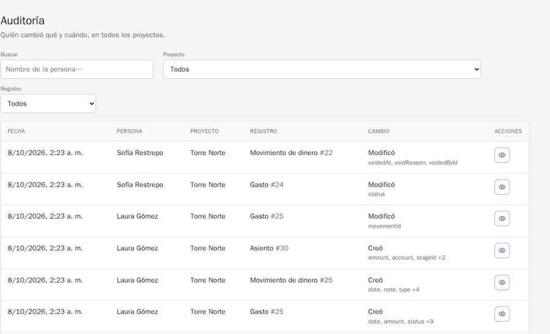
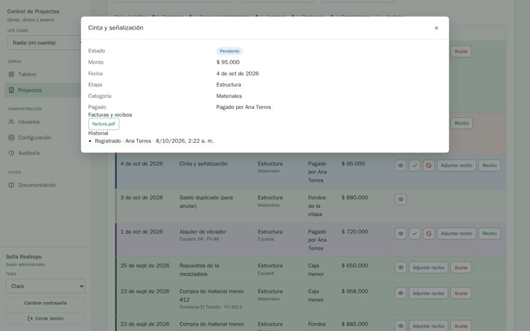

# QA-0008 · Auditoría shows raw English field names and a numeric date format

## Summary

The Cambio column lists code identifiers ("voidedAt, voidReason, voidedById", "movementId", "amount, account, stageId +2") and dates read "8/10/2026, 2:23 a. m.", unlike the "7 de oct de 2026" used everywhere else; the filter bar breaks onto two rows because the Proyecto select stretches to the longest project name.

## Steps to reproduce

Account: admin@demo.test (super admin) · Data: `make seed` + the edge-case data of run 2026-10-07-admin-ui · Width: 1440 and 390 · Theme: light

1. /audit at 1440px.
2. Look at the Cambio column and the Fecha column.
3. Look at the filter bar (Proyecto, Registro).

## Expected

Commit 010a385: "code is written in English; Spanish comes only from translations". Skill rule 3.1 › Copy: no raw keys, no developer messages. Dates in the app's one format. FilterBar controls on one line.

## Actual

Field names come straight from the entity; date uses a different formatter; Registro wraps under Proyecto.

## Evidence

The same numeric format appears in the expense detail modal's Historial ("8/10/2026, 2:22 a. m."). Times show in the browser's zone (UTC in this run), not the project's.

## History

- 2026-10-07 · found in run 2026-10-07-admin-ui at 4391ad0
