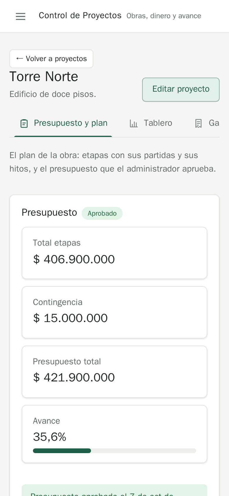
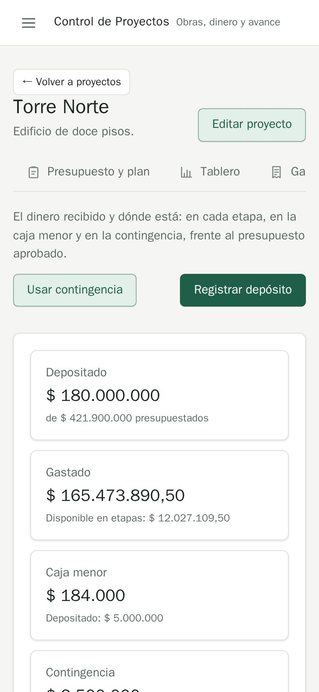

# QA-0010 · On a phone, the project tabs are cut off with no sign they scroll, and the header takes the first screen

## Summary

Only 2.5 of 6 tabs are visible ("Presupuesto y plan, Tablero, Ga…"); Fondos, Caja menor and Resumen are reachable only by guessing the tab bar scrolls. Four stat cards stack one per row, so the first table starts after about 1.5 screens.

## Steps to reproduce

Account: admin@demo.test (super admin) · Data: `make seed` + the edge-case data of run 2026-10-07-admin-ui · Width: 390 · Theme: light

1. /projects/1?tab=plan at 390px.
2. Try to find Caja menor.

## Expected

Skill rule 3.2: nothing cut off at 390px. The active tab is visible and the bar shows that it scrolls (fade, arrows, or wrap / a select).

## Actual

The bar is clipped mid-word; the stat cards are each full-width.

## Evidence

`.tabs-page { overflow-x: auto }` (app.css:1458) with no affordance.

## History

- 2026-10-07 · found in run 2026-10-07-admin-ui at 4391ad0
- 2026-10-08 · fixed in `f9f9aee` on `feature/ui-audit-fixes`; re-checked on its stack at 1440 and 390 px: short labels, active tab in view, fade (smoke UI-06; tab names kept accessible in acec512)
