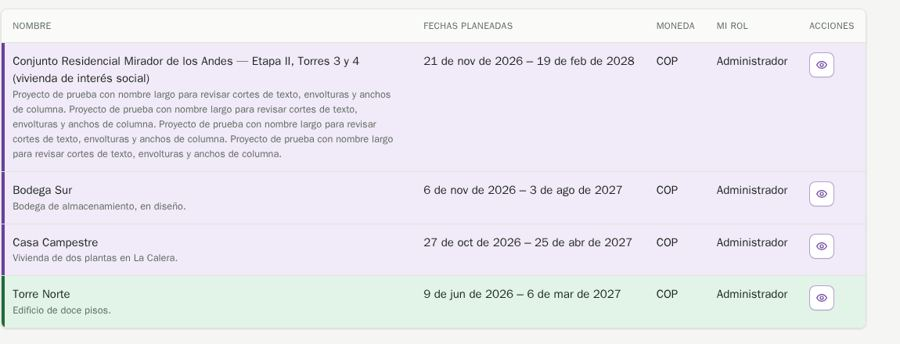
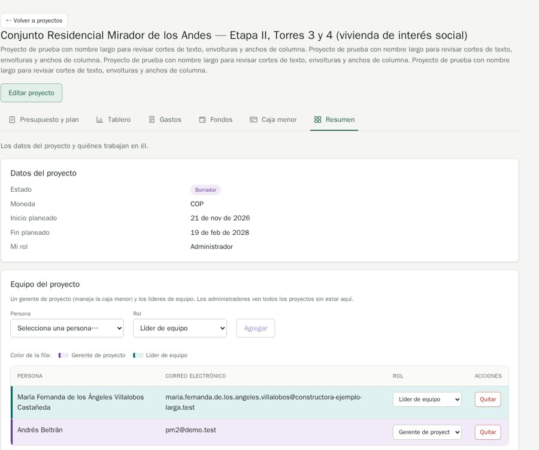

# QA-0011 · Long names and descriptions are never clamped

## Summary

A long project description prints in full in the Proyectos table and in the project header; a long name moves "Editar proyecto" under the description (it is at the right on other projects); in Resumen › Equipo the role select truncates to "Gerente de proyect".

## Steps to reproduce

Account: admin@demo.test (super admin) · Data: `make seed` + the edge-case data of run 2026-10-07-admin-ui · Width: 1440 and 390 · Theme: light

1. /projects (the "Conjunto Residencial …" row).
2. /projects/4?tab=overview.

## Expected

MDX ux.md › Cells: long text a person wrote gets `cell-clamp` (three lines, the whole text as the tooltip). The header keeps the same layout whatever the name's length.

## Actual

Five-line description in a table row; the header layout changes with the content; select text cut.

## Evidence

## History

- 2026-10-07 · found in run 2026-10-07-admin-ui at 4391ad0
- 2026-10-08 · fixed in `ed38737` on `feature/ui-audit-fixes`; re-checked on its stack at 1440 and 390 px
