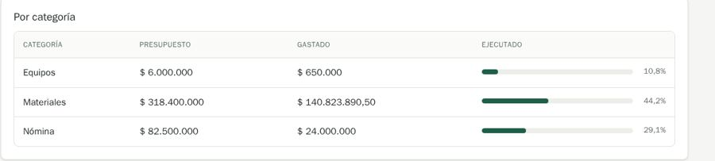

# QA-0013 · Amounts mix whole pesos and cents and are left-aligned

## Summary

"$ 165.473.890,50" sits next to "$ 406.900.000" because pesos show cents only when non-zero; money columns are left-aligned, so digits do not line up.

## Steps to reproduce

Account: admin@demo.test (super admin) · Data: `make seed` + the edge-case data of run 2026-10-07-admin-ui · Width: 1440 and 390 · Theme: light

1. /dashboard, Torre Norte card.
2. /projects/1?tab=finance › Por categoría.

## Expected

One precision per currency on a screen, money right-aligned in tables (house style for figures).

## Actual

Mixed precision (by design, shared/lib/format.ts:4), left-aligned.

## Evidence

Unclear: whether COP should ever show cents. The API accepts two decimals.

## History

- 2026-10-07 · found in run 2026-10-07-admin-ui at 4391ad0
- 2026-10-08 · fixed in `ed38737` on `feature/ui-audit-fixes`; re-checked on its stack at 1440 and 390 px
