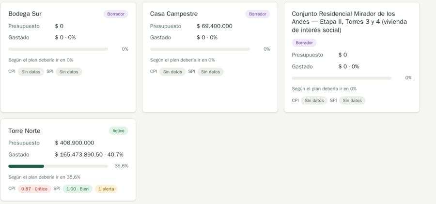

# QA-0015 · Portfolio cards: badge moves under long names, draft cards full of "Sin datos"

## Summary

With a long name, the status badge drops below the title instead of staying at the top right; draft projects show CPI and SPI "Sin datos" chips; the "1 alerta" chip does not link to the alerts; the Etapas table on the project Tablero shows "30 de ago de 2026 – ···" for a stage in progress.

## Steps to reproduce

Account: admin@demo.test (super admin) · Data: `make seed` + the edge-case data of run 2026-10-07-admin-ui · Width: 1440 and 390 · Theme: light

1. /dashboard at 1440px.
2. /projects/1?tab=dashboard › Etapas.

## Expected

MDX ux.md › Dashboard tiles: a figure is a link to the list it counts. Cards of one grid share a layout.

## Actual

As described.

## Evidence

## History

- 2026-10-07 · found in run 2026-10-07-admin-ui at 4391ad0
- 2026-10-08 · fixed in `ed38737` on `feature/ui-audit-fixes`; re-checked on its stack at 1440 and 390 px
