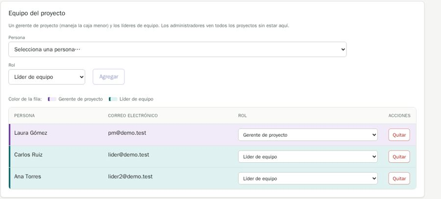

# QA-0016 · The add-member form changes layout with content, and roles are shown as row tints

## Summary

The Persona select is full width on Torre Norte and half width on another project, pushing Rol and Agregar onto a second line; the table tints rows by role (purple / teal) with a legend, although a role is not a status, and also shows it in a select.

## Steps to reproduce

Account: admin@demo.test (super admin) · Data: `make seed` + the edge-case data of run 2026-10-07-admin-ui · Width: 1440 and 390 · Theme: light

1. /projects/1?tab=overview, then /projects/4?tab=overview.

## Expected

MDX §3: data with no status stays plain. An inline add form keeps one layout (like Nueva categoría on the Plan tab).

## Actual

As described.

## Evidence

## History

- 2026-10-07 · found in run 2026-10-07-admin-ui at 4391ad0
- 2026-10-08 · fixed in `ed38737` on `feature/ui-audit-fixes`; re-checked on its stack at 1440 and 390 px
