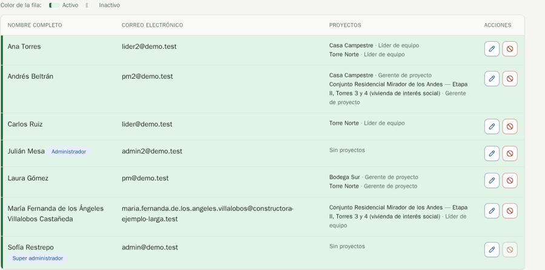
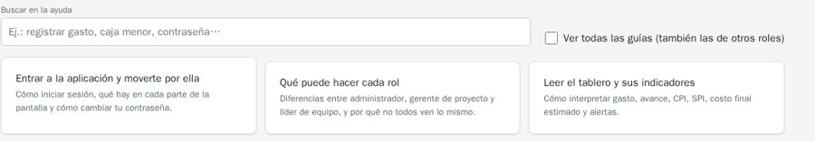

# QA-0017 · Small layout drifts on the admin pages

## Summary

Usuarios: "Administrador" sits inline after the name but "Super administrador" wraps under it, and every row is tinted green because the list starts on "Solo activos". Configuración: inputs alternate between narrow and wide, and the label "Límite por gasto de líder de equipo" is "Límite de líder de equipo" on Gastos. Documentación: the first card starts 6px higher than its neighbours, and the checkbox is not aligned with the search input.

## Steps to reproduce

Account: admin@demo.test (super admin) · Data: `make seed` + the edge-case data of run 2026-10-07-admin-ui · Width: 1440 and 390 · Theme: light

1. /users. 2. /settings. 3. /help at 1440px.

## Expected

MDX §3: "When every row shares one status, colour by the field that actually varies"; one word per meaning; cards of a grid aligned.

## Actual

As described.

## Evidence

## History

- 2026-10-07 · found in run 2026-10-07-admin-ui at 4391ad0
- 2026-10-08 · fixed in `ed38737` on `feature/ui-audit-fixes`; re-checked on its stack at 1440 and 390 px
